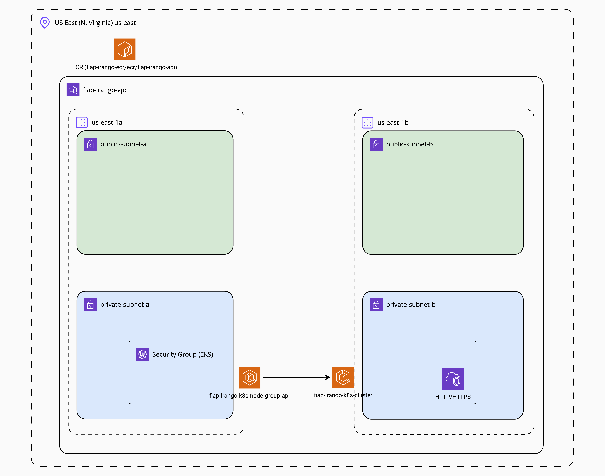

# Fiap iRango K8s


## Architecture Diagram:


## Dependencies
- [Terraform](https://developer.hashicorp.com/terraform/install?product_intent=terraform)
- [Kubernetes](https://kubernetes.io/)
- Make
  - [Windows](https://gnuwin32.sourceforge.net/packages/make.htm)
  - Linux:
  ```bash
  sudo apt update
  sudo apt install make
  ```

## Instructions to run
Before all, you need set AWS credentials and Application ENVs using:
```bash
export AWS_ACCESS_KEY_ID=xxxxxx
export AWS_SECRET_ACCESS_KEY=xxxxxx

# Docker image of fiap-irango-api service
export IMAGE_URI=xxxxxx

export SENTRY_DSN=xxxxxx
export DB_HOSTNAME=xxxxxx
export DB_USERNAME=xxxxxx
export DB_PASSWORD=xxxxxx
export REDIS_HOSTNAME=xxxxxx
```
Or configure it in windows environments.

### Using make
```bash
# To init terraform
make init

# To run terraform plan
make plan

# To apply changes
make up

# To deploy API pods
make up.api
```

To destroy resources:
```bash
make down
```

### Without make
```bash
# To init terraform
terraform -chdir=terraform init

# To run terraform plan
terraform -chdir=terraform plan

# To apply changes
terraform -chdir=terraform apply -auto-approve

# To deploy API pods
aws eks update-kubeconfig --name fiap-irango-k8s-cluster --region us-east-1
envsubst < ./.k8s/api/template-secrets.yml > .k8s/api/secrets.yml
envsubst < ./.k8s/api/template-migration.yml > .k8s/api/migration.yml
envsubst < ./.k8s/api/template-deployment.yml > .k8s/api/deployment.yml
kubectl apply -f .k8s/api/namespace.yml
kubectl apply -f .k8s/api/secrets.yml
kubectl apply -f .k8s/api/configmap.yml
kubectl apply -f .k8s/api/migration.yml
kubectl apply -f .k8s/api/deployment.yml
kubectl apply -f .k8s/api/service.yml
kubectl apply -f .k8s/api/hpa.yml
```

To destroy resources:
```bash
terraform -chdir=terraform destroy -auto-approve
```
